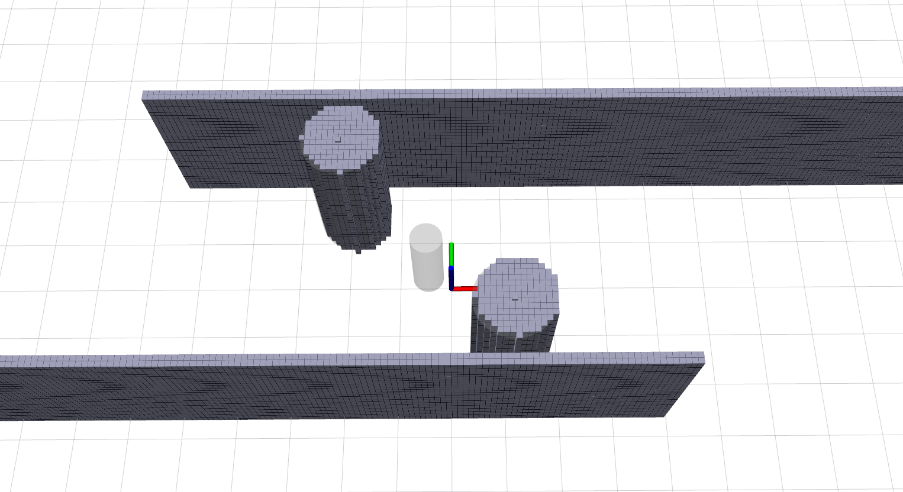
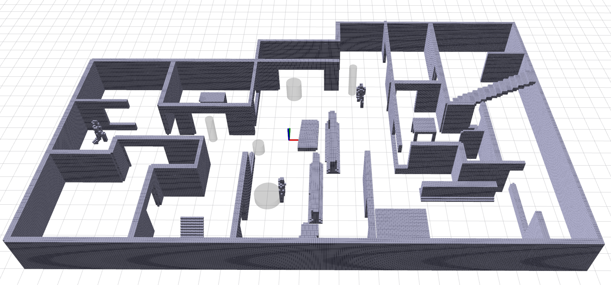
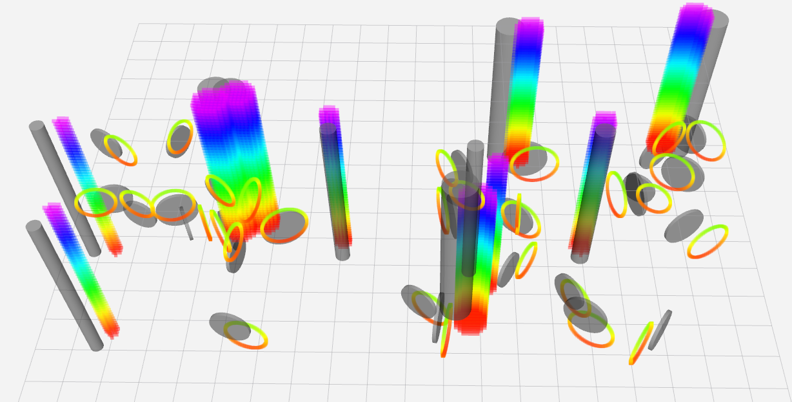

# dynamic_map_generator
Independent ros package to generate random map. The code is revised from [dynamic_map_generator](https://github.com/siyuanwu99/dynamic_map_generator) in github，and the origin version is 
[map_generator](https://github.com/yuwei-wu/map_generator). 
It works with simulator in [fast planner](https://github.com/HKUST-Aerial-Robotics/Fast-Planner) and [ego planner](https://github.com/ZJU-FAST-Lab/ego-planner-swarm).

nros开发进一步改动内容：
- 支持静态点云pcd文件导入，静态真值点云可使用工具插件[gazebo_map_plugins](https://git.nrs-lab.com/hitsz-nrsl/gazebo_map_plugins)从gazebo环境中生成。
- 支持指定每个动态圆柱的位置，速度方向，运动范围。
- 新增两种障碍物：Wall和Box。Wall可以用于设定墙壁类障碍，Box可以模拟305实物实验搭建的泡沫块障碍。

## Usage
下载到自己的工作空间ws/src下，编译即可。

生成场景1：
```bash
roslaunch map_generator simulator_fake_sts.launch
roslaunch map_generator rviz.launch
```


生成场景2：
```bash
roslaunch map_generator simulator_fake_bigHouse.launch
roslaunch map_generator rviz.launch
```


生成随机运动障碍物：
```bash
roslaunch map_generator dyn_map.launch
```


在G305做实物实验的场景：
```bash
roslaunch map_generator simulator_fake_realExp.launch
roslaunch map_generator rviz.launch
```

### 参数
#### output topic name:
`/map_generator/global_cloud`：在launch文件中重映射名称，为发布的障碍物点云话题，可以设置包含or不包含动态障碍物点云。

`/ground_truth_state`：在launch文件中重映射名称，为发送的**动态**障碍物测量信息，可以设置添加噪声。

#### param: 

静态点云相关：

`sensing/rate`：发布消息的频率，下游的卡尔曼滤波等状态估计模块需要参考这个频率。

`load_pcd_file`：选择是否从文件中加载静态点云pcd文件。（pcd文件如何获得可以参考使用工具插件[gazebo_map_plugins](https://git.nrs-lab.com/hitsz-nrsl/gazebo_map_plugins)从gazebo环境中生成。

`file_path`：点云pcd文件的路径。

`map/resolution`和`map/frame_id`:发布点云的分辨率，坐标系。

`map/wall_num`、`map/box_num`、`map/obj_num`：墙壁障碍物、箱子障碍物、圆柱障碍物的数量。其中只有圆柱障碍物是可以设置为运动障碍物的。


动态障碍物点云相关：

`dyn_obj_cld_pub`：是否发布动态障碍物点云。

`sensing/noise_level`：发布的动态障碍物测量信息添加噪声的程度。

`obs1x`、`obs1y`、`obs1w`、`obs1h`：圆柱的位置、半径、高度。

`mode1`：圆柱的运动模式。0表示采用给定的x和y方向的速度；1表示只用vx而vy为0；2表示只用vy而vx为0；3表示静止，不使用给定速度。默认圆柱静止。

`given_vel1x`、`given_vel1y`：给定的圆柱的运动速度。在simulator_fake_bigHouse.launch和simulator_fake_sts中的单位都是m/s。

`obs1x_l`、`obs1x_h`、`obs1y_l`、`obs1y_h`：圆柱的运动范围，触边反向。

以下为原仓库自带内容

---

## Demo

1. generate a point cloud global map of boxes and circles. 


1. generate semantic map.

you can also directly use the semantic information and create your own semantic map for planning. The example generates the semantic map of cylinders and publish both the cylinders informaton and point cloud.


3. generate dynamic map


